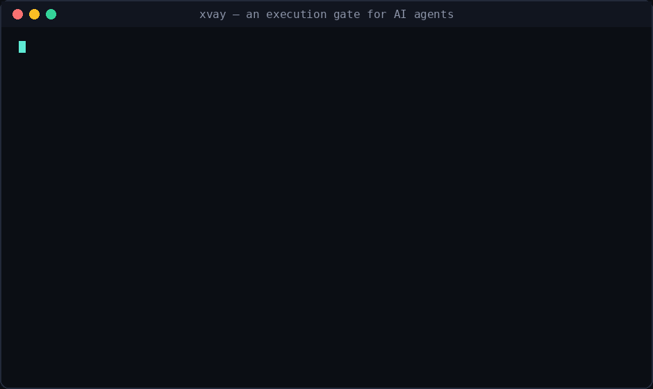

# XVay — an execution gate for AI agents

XVay decides whether an agent's tool call has **enough evidence to run, right
now** — *before* it executes, from the request text alone, outside the model.
It returns one of three verdicts:



- **COMMIT** — enough evidence; let it run.
- **VERIFY** — not enough evidence; a human should approve first.
- **BLOCK** — the request contradicts something the operator explicitly declared.

It is **not** a policy engine and does not decide what is "dangerous." The
operator declares what matters (protected resources, egress tools, limits) in a
signed envelope; XVay only measures whether the evidence for *this* action is
sufficient. That separation is deliberate: XVay is auditable precisely because it
never guesses intent.

## Why it exists

Most agent guardrails run inside the model (promptable, bypassable) or require a
heavy runtime that executes actions in a sandbox and rolls them back. XVay sits
in between: a **pre-execution check** at the tool-dispatch boundary with
near-zero integration and ~0.6 ms per call. No shadow filesystem, no effect
outbox, no per-framework adapters, no code execution.

## What it catches (and what it does not)

XVay is honest about its threat model. It is strong at:

- non-read actions on operator-declared protected resources → **BLOCK**
- cross-step secret → declared-egress flows → **BLOCK**
- shell-control / command-substitution injection into a non-shell tool argument
  (`read_file` given `config.yaml > /etc/passwd`) → **VERIFY**
- unbounded or oversized irreversible fan-out (`rm *.log`) → **VERIFY**
- destructive verbs hidden in flags (`find . -delete`) → **VERIFY**
- a write destination inside a protected system dir (`download → /etc/cron.d/`) → **VERIFY**
- references to well-known credential paths (`.ssh/`, `.aws/credentials`) → **VERIFY**

Ordinary shell it deliberately leaves alone: arithmetic expansion `$((...))`,
read-only command substitution (`$(id -un)`, `$(find ...)`), and writes under a
user's own `$HOME` or `/tmp`. The substitution check fires on live command
substitution (`$(curl ...)`, backticks), not on math or read-only lookups.

It does **not** catch:

- **Prompt injection that keeps the agent in-scope.** If an attack makes the
  agent perform an *allowed* action with ordinary-looking arguments (e.g. a
  money transfer to the wrong recipient), XVay has no structural signal to act
  on. Measured previously on AgentDojo: ~2% of such attacks stopped with zero
  config, ~55% with a protective config. This is a design boundary, not a bug.
- **Content lineage of undeclared secrets.** A log that happens to contain a key,
  summarised and then sent out, requires tracking derived data through
  execution — which XVay deliberately does not do.

If your hard requirement is automatic rollback or data-flow lineage, XVay is the
wrong tool.

## Real-agent coverage

XVay is replayed against **real recorded agent traffic from five independent
sources**, spanning three problem domains and three record formats — not traffic
we invented. Two things are measured, and they pull in opposite directions:

- **Friction** — on benign traffic, how often does XVay get in the way? A tool
  that stops ordinary dev work gets uninstalled, so low friction is the bar.
- **Robustness** — on adversarial traffic, does it still catch the structural
  red flags it claims to (out-of-scope calls, sensitive-path writes, smuggled
  arguments)?

| corpus | domain / shape | calls | friction |
|---|---|---|---|
| OpenHands (`nebius/SWE-rebench-openhands-trajectories`) | SWE / bash, tools as dicts | 2,525 | **1.0%** |
| SWE-agent (`nvidia/Open-SWE-Traces`) | SWE / bash, tools as JSON strings + heredocs | 5,068 | **1.9%** |
| APIGen (`Salesforce/APIGen-MT-5k`) | airline / structured API, non-bash | 124 | **0.0%** |
| AgentInstruct (`THUDM/AgentInstruct`, os) | real Linux bash sessions | 410 | **1.7%** |
| AgentHarm (`ai-safety-institute/AgentHarm`) | adversarial / harmful behaviors | 652 | see below |

On the benign corpora, essentially every stop is a genuine irreversible op
(`rm`, `-delete`) or a sensitive-file read (`cat /etc/passwd`); there are
**zero** unexpected false positives after hardening. Reproduce with:

```bash
pip install datasets
python real_agent_benchmark.py 100 openhands
python real_agent_benchmark.py 100 sweagent
python real_agent_benchmark.py 40  apigen
```

On AgentHarm the honest result has two parts. XVay COMMITs ~99% of calls —
**correctly**, because it is not a content or intent judge and never claimed to
be; a `paypal_transfer` is structurally an allowed call if the agent holds that
tool. What it *does* catch, even here, are the structural attacks: a
credential-path read smuggled into an email body, a download whose destination
is `/etc/cron.d/`, an out-of-scope tool the agent was never granted, a
`curl | sh` inside a terminal argument. That boundary — structure yes, intent
no — is the product being honest about what it is.

## Install

```bash
git clone https://github.com/zahraarmantech/Xvay
cd xvay
pip install -r requirements.txt   # just pynacl, for envelope signing
```

## Use

```python
import mcp_live_gate as gate
from connectors import to_canonical

catalog = to_canonical("openai", "agent_schema.json")   # your tools
request = {"method": "tools/call",
           "params": {"name": "read_file", "arguments": {"path": "config.yaml"}}}

envelope = {                      # what the operator declares
    "environment": ["staging"],
    "protected_resources": ["orders-primary"],
    "egress_tools": ["send_email", "curl"],
}
decision, reason, forward = gate.check(request, catalog,
                                       task_scope="staging", envelope=envelope)
print(decision, "-", reason)      # COMMIT / VERIFY / BLOCK
```

For production the envelope should be **signed** (Ed25519); see
`envelope_auth.py` and `samples/sample_envelope.json`.

## Run the tests

Every claim above is checked by a test in this repo.

```bash
for t in adversarial_benchmark property_test identity_test real_agent_benchmark; do
  echo "== $t =="; python3 $t.py
done
```

> **Windows:** use `python` instead of `python3` (the `python3` alias usually
> isn't defined). In Git Bash the loop above works as-is once you swap the
> command; in PowerShell, run each test with `python <name>.py`.

The proof tests:

| test | what it proves |
|---|---|
| `property_test.py` | 245 generated spelling/transform cases; no dangerous action ever COMMITs, no benign one is ever stopped |
| `adversarial_benchmark.py` | 38 hand-built attacks incl. shell-injection; 0 leaks, 0 friction |
| `identity_test.py` | 8 structural invariants over 4,896 inputs: the wrapper checks only ever downgrade COMMIT→VERIFY, never execute, never emit BLOCK |
| `real_agent_benchmark.py` | replays real recorded traffic from four independent agent sources (see *Real-agent coverage* above); measures compatibility + friction honestly |

## How it works (one paragraph)

`execution_gate.py` is the frozen core: it answers the evidence question and
nothing else. `gate_with_envelope.py` wraps it with operator-declared checks
that can only **downgrade** a COMMIT to VERIFY — they never turn a VERIFY or
BLOCK back into COMMIT, and never invent a BLOCK. `arg_check.py` inspects
argument structure. `mcp_live_gate.py` is the live entry point for MCP
`tools/call` interception. `connectors.py` / `schema_extractor.py` map various
agent frameworks (OpenAI, MCP, LangGraph, CrewAI, AutoGen, OpenAPI, CLI) to one
canonical form. The core's behaviour is pinned by md5 in the tests, so any change
to it is loud.

## Status

This is a working reference implementation with a real test suite. It has **not**
yet been validated in production against a paying user's traffic — that is the
honest open question, and no benchmark answers it. Feedback from real agent
deployments is the most useful contribution you can make.

## License

AGPL-3.0. If you run a modified version as a network service, you must make your
modified source available to its users. If you want to use XVay in a closed
commercial product, contact the author about a separate commercial license.

## A note on the name

Formerly developed under the name "Poker." XVay is the same execution-gate idea.
